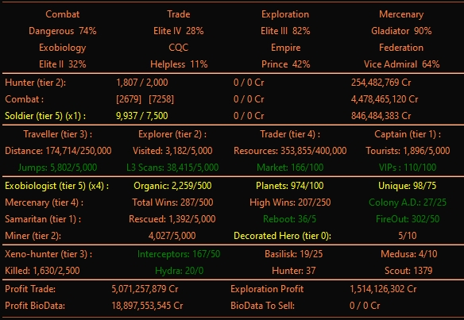

# InaraProgress

Plugin for EDMC  [Market Connector](https://github.com/EDCD/EDMarketConnector/wiki)

Allows tracking of Elite Dangrous ranks and [INARA](https://inara.cz/) awards. 

[Overlay](https://github.com/inorton/EDMCOverlay) also show unsold Biological samples and bounties, combat bonds, on-foot combat bonds.

# Image

# Instalation

 *  Download the `latest release` of both InaraProgress and dataprogress.db
 * Extract the `.zip` archives that you downloaded into the EDMC `plugins` folder 
 
 * A `dataprogress.db` file is saved to the primary EDMC data storage directory, where plugins are installed.

     On Windows this is generally located at `%LOCALAPPDATA%\EDMarketConnector\dataprogress.db`.

 * Install the [EDMCOverlay](https://github.com/inorton/EDMCOverlay) plugin for overlay support
 * Start or restart EDMC to register the plugin and first run parsing Journal logs in plugin settings

# Function
 Tracks not sold bio samples and automatically exports their location to text file in event of untimely demise.
 In Dir `%LOCALAPPDATA%\EDMarketConnector\data_lost\bio_*death timestamp*.txt` 

Trade Profit - Shows profits counting to rank progress

Display progress Titan - select titan in options

Display progress Community Goals - read progress from journal
